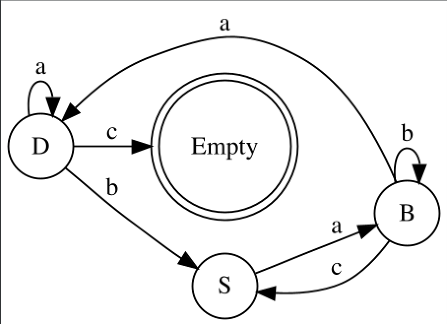

# Formal Languages and Compiler Design - lab #1

## Task:
**1. Write a program which converts regular grammar to Finite Automaton (FA).**

**2. Using Finite Automaton (FA) check if some input string is accepted by FA  (meaning you could generate that string by traversing FA).**

**3. Determine the grammar type by the Chomsky classification.**
 
According to Chomksy classification of grammars, this grammar is of type 3 (Right-Linear) because it satisfies the 2 conditions:
1. A -> aB
2. A -> a

**4. Bonus Point -> Using some graphic library plot FA graph.**

