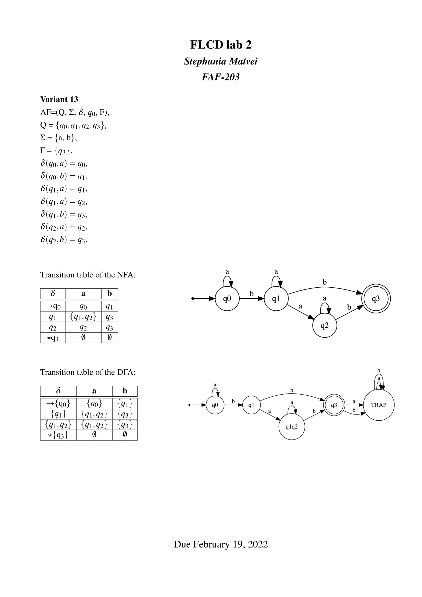
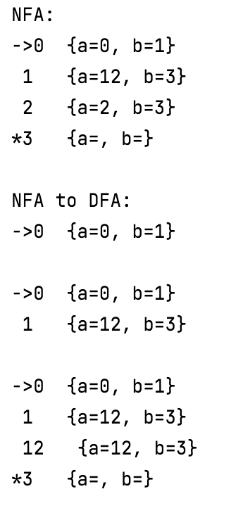

# Formal Languages and Compiler Design - lab #2

## Task:
**1. Convert NFA from your variant to DFA on paper, writing all transitions and drawing converted automato.**

**2. Write program which converts Nondeterministic Finite Automato (NFA) to Deterministic Finite Automato (DFA).**

**3. Display converted automato in form of graph or transition table.**

